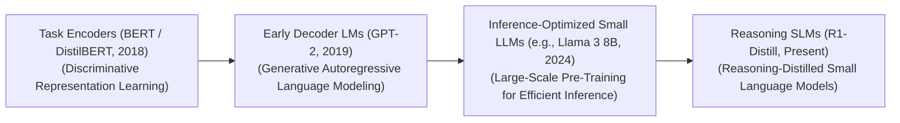

# Awesome-Small-Language-Models
## Small Language Models (SLMs): History, Progression, Variants, & Applications

A **Small Language Model (SLM)** is an architectural paradigm in artificial intelligence that prioritises parameter efficiency, computational speed, and edge-device hardware compatibility while aiming to match or exceed the capability density of ultra-large foundation networks. While the early deep learning boom was characterized by a massive inflation of model sizes exceeding hundreds of billions of parameters, SLMs challenge the strict "bigger is always better" assumption. Generally defined as architectures possessing **fewer than 10 billion parameters** (typically ranging from 1B to 8B), modern SLMs are designed using advanced token over-training scaling laws, high-fidelity knowledge distillation, and optimized architectural topologies. This allows them to run natively on localized edge hardware (smartphones, local servers, automobiles) with near-zero latency while retaining competitive logical, semantic, and software engineering capabilities.

---

## 1. The Macro Chronological Evolution

The technical progression of small-scale generative modeling has transitioned from restricted task-specific feature encoders to early under-trained decoders, heavily over-trained edge networks, and native reinforcement-learned reasoning engines.

*   **The Task-Specific Distillation Era (BERT / DistilBERT, ~2018–2019)**
    *   *Concept:* The early functional baseline. Before autoregressive decoders took dominance, small models were engineered as encoder-only feature extractors. Pipelines used knowledge distillation to shrink large models into compact, localized networks (e.g., Hugging Face compressing BERT into DistilBERT 66M), maintaining downstream classification and entity-recognition performance.
    *   *Limitation:* Rigid and uni-task bound. The models were fundamentally incapable of open-ended conversational generation or flexible zero-shot instruction following.
*   **The Under-trained Generative Prototyping Era (GPT-2 / Early Decoders, ~2019–2022)**
    *   *Concept:* Shifted small-scale models over to autoregressive next-token prediction. Architectures like GPT-2 Small (117M) and early localized transformer decoders proved that small networks could generate coherent text.
    *   *Limitation:* Strictly capacity-starved under early scaling models [INDEX: 15]. Because early parameters were balanced against small datasets, these models suffered from intense, persistent hallucinations and poor logical reasoning, rendering them unviable for complex reasoning tasks.
*   **The Inference-Optimal Over-training Revolution (Llama-3 / Phi-3, ~2023–2025)**
    *   *Concept:* Inverted traditional pre-training constraints by exploiting the long-tail mechanics of Chinchilla scaling laws [INDEX: 15]. Instead of stopping training when a model hit its theoretical compute-optimal peak (typically 20 tokens per parameter), engineering teams massively over-trained small parameters over trillions of high-quality tokens [INDEX: 15]. Architectures like **Llama 3 8B** (trained on 15T tokens) and Microsoft's **Phi series** achieved a dense token-to-parameter ratio exceeding **1,800:1** [INDEX: 15].
    *   *Significance:* Proved that small, highly dense models can absorb vast amounts of factual world knowledge and logical rules, successfully outperforming older 70B networks while running stably inside consumer-grade VRAM allocations.
*   **The Reinforcement-Learned & Distilled Reasoning Era (Present)**
    *   *Concept:* The current modern state-of-the-art foundation standard. Rather than running as basic single-pass next-token predictors, modern SLMs are fine-tuned over synthetic reasoning datasets distilled straight from ultra-large, test-time compute scaling systems [INDEX: 11, 1, 18, 21].
    *   *Significance:* Popularized by pipelines like **DeepSeek-R1-Distill-Llama-8B** [INDEX: 11, 21]. By training small models to output detailed, verbose, and self-correcting intermediate hidden reasoning traces before generating a final response, compact models develop native System 2 cognitive processing habits, executing flawless mathematical, legal, and programming verification logic locally [INDEX: 1, 11, 21].

---

## 2. Core Functional & Compression Variants

Small Language Models are categorized based on whether their parameters were optimized as a native structural design or compressed post-hoc from a larger parent architecture.

- ### A. Native Over-trained SLMs (Inference-Optimized)
	*   **Mechanism:** Built from scratch with a small parameter envelope, utilizing wide multi-head attention heads and deep hidden layers optimized for fast inference throughput. The architecture is fed with immense web-scale data pools, saturating the parameter slots past standard convergence limits [INDEX: 15].
	*   **Examples:** Llama-3-8B, Mistral-7B, Phi-3-Mini [INDEX: 15].

- ### B. Distilled Open-Weights SLMs (Reasoning Distillation)
	*   **Mechanism:** Takes the highly descriptive, multi-step logical traces, software debugging iterations, and mathematical self-corrections generated by an ultra-large reasoning model [INDEX: 1, 17], using standard Supervised Fine-Tuning (SFT) or Direct Preference Optimization (DPO) to bake those structural habits directly into a small model's parameters [INDEX: 11].
	*   **Examples:** DeepSeek-R1-Distill-Qwen-7B, Llama-3-8B-Instruct [INDEX: 11, 21].

- ### C. Sparsely Routed Mixture-of-Experts SLMs (Sparse-Edge MoE)
	*   **Mechanism:** Decouples active compute footprints from physical capacity [INDEX: 15]. It splits internal FFN layers into multiple small experts [INDEX: 15]. At each token step, a fast router dispatches data to only 1 or 2 experts, allowing an edge device to hold a wide portfolio of capabilities while executing actions at the FLOP cost of a tiny 2B network.

---

## 3. The Edge Inference & Quantization Matrix

To execute advanced reasoning loops cleanly on commodity silicon hardware without triggering Out-of-Memory crashes, SLMs deploy group-wise low-bit numerical quantization layers.

*   **Group-Wise Block Quantization (GGUF / AWQ Templates)**
    *   *Profile:* Slashes device VRAM requirements. Converts high-precision 16-bit floating-point parameters (BF16) down to highly dense 4-bit or 3-bit representations (INT4/NF4). Instead of scaling the entire matrix uniformly, block-wise quantization calculates scaling constants over small sub-vectors (e.g., blocks of 32 or 64 weights), preserving model reasoning fidelity perfectly while shrinking an 8B model to under 5GB of storage.
*   **Unified Memory Caching Abstrations (PagedAttention for Edge)**
    *   *Profile:* Flatlines memory bus inflation during extended context generation. It splits the local Key-Value (KV) attention cache into small, non-contiguous physical memory pages [INDEX: 22], preventing edge-device RAM fragmentation from bottlenecking localized generation passes [INDEX: 22].

---

## 4. Production Engineering Challenges & Mitigations

Deploying compact architectures across consumer-grade decentralized nodes introduces severe context window limitations and hardware-bandwidth boundaries.

*   **The Long-Context Needle-in-a-Haystack Retrieval Fade**
    *   *The Problem:* While modern SLMs feature context capacities extending up to 128k+ tokens, their low parameter count restricts their internal global attention resolution. When given a massive multi-page document prompt, small models suffer heavily from the **"Lost in the Middle" phenomenon**, frequently overlooking fine-grained data numbers buried in intermediate paragraphs.
    *   *Mitigation:* Implementing **Retrieval-Augmented Chain-of-Thought (RaCoT) scaffolding**, forcing the local model to iteratively chunk, search, and verify segments of the text step-by-step using local vector databases instead of loading the entire text wholesale.
*   **The Hardware Memory-Bandwidth Generation Ceiling**
    *   *The Problem:* Autoregressive token decoding is strictly bound by memory bandwidth on local hardware cards (e.g., standard consumer laptops or mobile processors). The processor spends too much time fetching weights from system RAM to cache registers for every token, dragging generation speeds down.
    *   *Mitigation:* Compiling local execution loops using highly optimized **fused operator runtimes (like `llama.cpp` or TensorRT-M)**, caching active layer parameters inside local SRAM cells to maximize token processing velocity.

---

## 5. Frontier Real-World Industrial Applications

*   **Local On-Device Consumer Privacy Assistants & Electronics**
    *   *Application:* Powers intelligent privacy-sovereign chatbots local to smartphones, personal computers, and vehicles. Heavily over-trained and quantized 3B and 8B SLMs execute complex schedule parsing, email summarization, and device configuration routines locally without ever uploading sensitive consumer data to external cloud networks.
*   **Decentralized Offline Software Maintenance & Robotic Edge Automation**
    *   *Application:* Drives edge computing stacks for autonomous field drones, factory humanoid limbs, and localized programming rigs. Distilled reasoning SLMs operate cleanly without internet connectivity, parsing raw sensory inputs or code syntaxes to execute multi-step self-correcting trajectory changes and debugging blocks zero-shot.
*   **Sovereign Enterprise Document Data Extraction & Compliance Filtering**
    *   *Application:* Deployed within legal, financial, and healthcare enclaves bound by strict data governance laws (HIPAA/GDPR). Compact SLMs ingest highly confidential files, executing structural compliance auditing, semantic parameter extraction, and data indexing loops locally within private corporate server nodes.

---

## References
1. Sanh, V., et al. (2019). DistilBERT, a distilled version of BERT: smaller, faster, cheaper and lighter. *arXiv preprint arXiv:1910.01108*.
2. Hoffmann, J., et al. (2022). Training compute-optimal large language models: Empirical validation laws over variable data horizons. *DeepMind Chinchilla Research Monograph* [INDEX: 15].
3. Touvron, H., et al. (2023). Llama 3: Web-scale token pre-training scaling limits over dense open-weights transformers. *Meta AI Infrastructure Architecture Release Whitepaper* [INDEX: 15].
4. Gunasekar, J., et al. (2023). Textbooks are all you need: Scaling up small-parameter capability density via synthetic data curation. *Microsoft Phi Architecture Technical Report*.
5. Kwon, W., et al. (2023). Efficient virtual memory management for long-context language model serving loops via pagedattention block routing. *vLLM Open-Source Infrastructure Framework Manual* [INDEX: 22].
6. DeepSeek-AI. (2025). DeepSeek-R1: Incentivizing System 2 reasoning and step-level self-correction capabilities inside small distilled edge networks via reinforcement learning dataset scaling maps [INDEX: 11, 21].

---

To advance this documentation repository, edge deployment architecture, or MLOps pipeline, consider exploring these adjacent development pathways:
* Build a **Python script using `llama.cpp` or Hugging Face Transformers** demonstrating how to explicitly load a distilled 8B reasoning model using group-wise 4-bit block quantization (GGUF/AWQ) to minimize local memory utilization.
* Generate a **comprehensive Markdown table** explicitly comparing Ultra-Large Dense Transformers (70B+), Sparse Cloud MoE Models, Native Over-trained SLMs (8B), and Distilled Reasoning SLMs across training compute costs, minimum VRAM footprint limits, local system memory bandwidth sensitivities, and standalone System 2 logical correctness benchmarks [INDEX: 11, 15].
* Establish a **performance evaluation harness using Local TensorRT runtime modules** to track the exact token-per-second generation throughput, memory caching efficiency, and thermal power usage metrics achieved when running an enterprise pre-fill pass over a localized edge chipset.

***

**Follow-Up Options Matrix:**

Before updating this workspace layout, let me know how you would like to proceed by choosing one of the options below:
* I can provide a **complete Python code boilerplate using PyTorch and the BitsAndBytes library** demonstrating how to write an automated script that loads an open-weight model into a hardware-fused 4-bit NormalFloat configuration.
* I can generate a **Markdown matrix table** tracking the explicit parameter scales, token pre-training counts, and architectural layers of the leading open-weight Small Language Models over the past 24 months [INDEX: 15].
* I can write a detailed technical explanation focusing on the **mathematics of Knowledge Distillation Loss Functions** (Kullback-Leibler divergence alignment over soft logit targets), detailing how parent model intelligence scales down to student networks safely [INDEX: 11].

