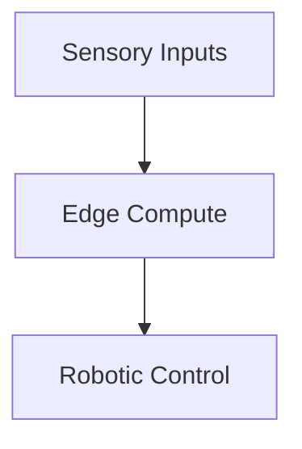

# Decentralized Offline Software Maintenance & Robotic Edge Automation

This page provides detailed information about Decentralized Offline Software Maintenance & Robotic Edge Automation.

## Architecture Diagram

[Back to README](../README.md)
