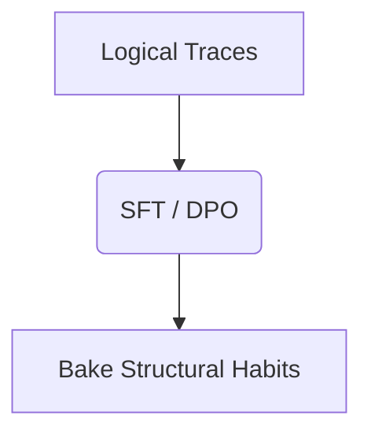

# Distilled Open-Weights SLMs (Reasoning Distillation)

This page provides detailed information about Distilled Open-Weights SLMs (Reasoning Distillation).

## Architecture Diagram

[Back to README](../README.md)
