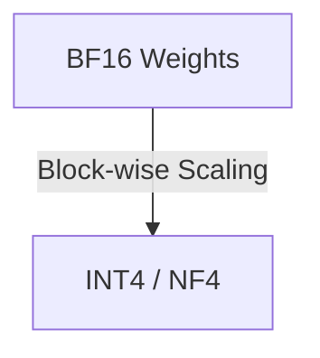

# Group-Wise Block Quantization (GGUF / AWQ Templates)

This page provides detailed information about Group-Wise Block Quantization (GGUF / AWQ Templates).

## Architecture Diagram

[Back to README](../README.md)
