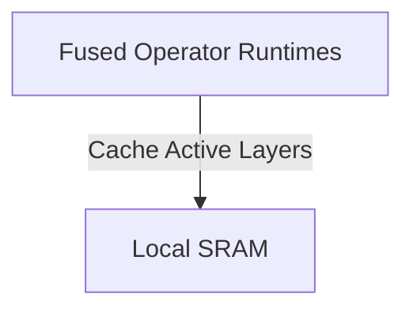

# The Hardware Memory-Bandwidth Generation Ceiling

This page provides detailed information about The Hardware Memory-Bandwidth Generation Ceiling.

## Architecture Diagram

[Back to README](../README.md)
