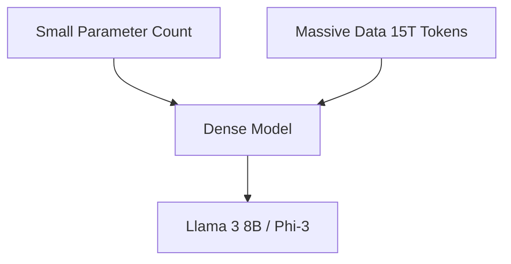

# The Inference-Optimal Over-training Revolution

This page provides detailed information about The Inference-Optimal Over-training Revolution.

## Architecture Diagram

[Back to README](../README.md)
