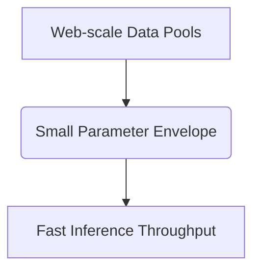

# Native Over-trained SLMs (Inference-Optimized)

This page provides detailed information about Native Over-trained SLMs (Inference-Optimized).

## Architecture Diagram

[Back to README](../README.md)
